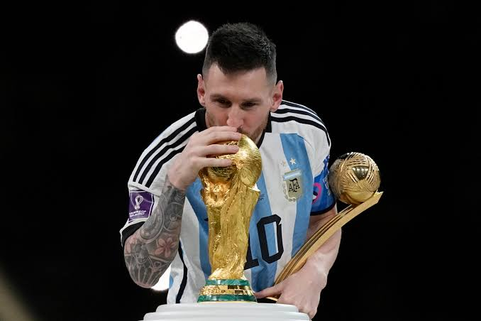

[← Volver al inicio](README.md)
# Temas del curso

### Mis aficiones — 18/09

Llevo jugando al futbol desde que tengo 8 años, he jugado toda mi vida en el Langreo, un equipo de mi ciudad, desde siempre me han encantado los deportes en general, empecé con los deportes con natación, estuve unos años hasta que empecé con kárate y como no tenía  tiempo para todo decidí hacer solo kárate, estuve en kárate bastantes años, llegué al cinturón marrón. A los 8 años en benjamines empecé a jugar al futbol y fue mi deporte hasta que me salí el año pasado y estuve yendo por temporadas al gimnasio. Aparte de los deportes mi otra afición son los videojuegos.

### 01/10 · Premios Princesa de Asturias: Lionel Messi

Leo Messi considerado de los mejores jugadores de la historia del futbol, el argentino futbolista actual del Inter de Miami, ha recibido el Premio Princesa de Asturias de los deportes 2026, ha sido premiado debido a su desempeño a lo largo de toda su carrera futbolística aparte de su gran calidad actual, el jugador con mas trofeos de la historia. También se a tenido en cuenta sus aportaciones sociales y su interés en apoyar la educación de los jóvenes en argentina. Le e elegido ya que de todos los premios que había el de deportes es el que más me interesaba y porque llevo jugando al futbol toda mi vida, aparte vi jugar a Messi desde que tengo uso de razón.

[Pagina Premio Princesa Asturias](https://www.fpa.es/es/premios-princesa-de-asturias/premiados/2026-leo-messi/?)

