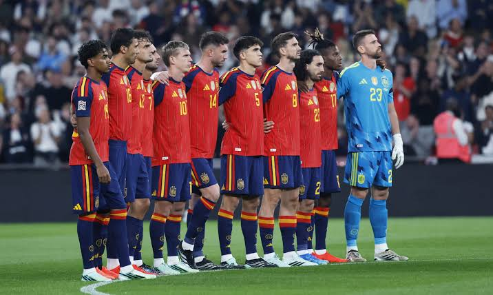

[← Volver al inicio](README.md)
# Temas del curso

### Mis aficiones — 18/09

Llevo jugando al futbol desde que tengo 8 años, he jugado toda mi vida en el Langreo, un equipo de mi ciudad, desde siempre me han encantado los deportes en general, empecé con los deportes con natación, estuve unos años hasta que empecé con kárate y como no tenía  tiempo para todo decidí hacer solo kárate, estuve en kárate bastantes años, llegué al cinturón marrón. A los 8 años en benjamines empecé a jugar al futbol y fue mi deporte hasta que me salí el año pasado y estuve yendo por temporadas al gimnasio. Aparte de los deportes mi otra afición son los videojuegos.

